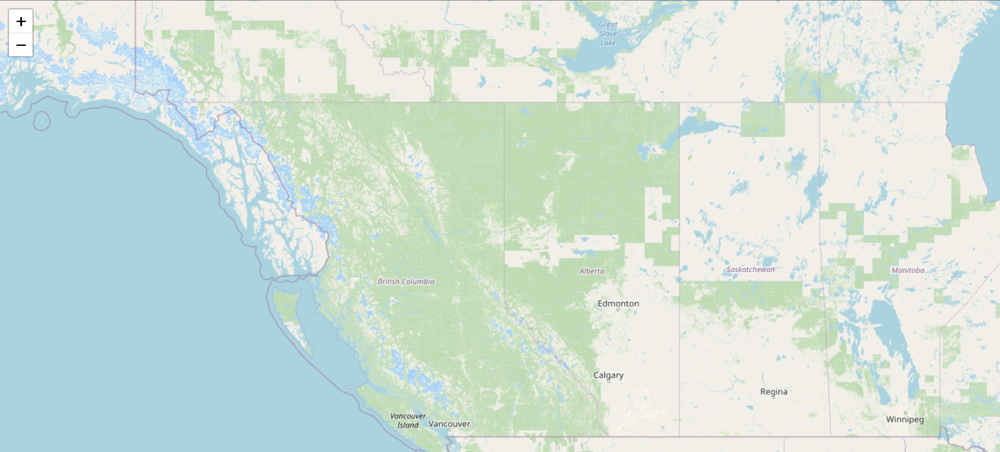
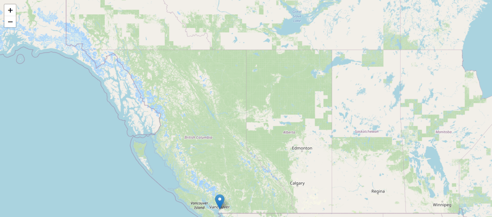
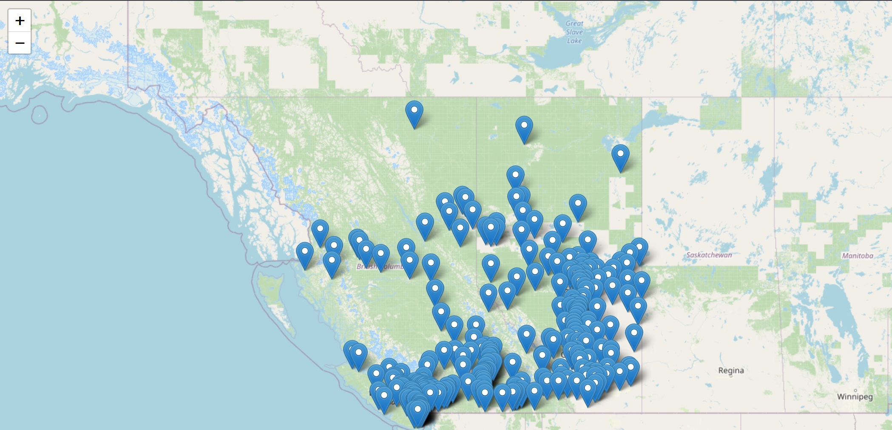
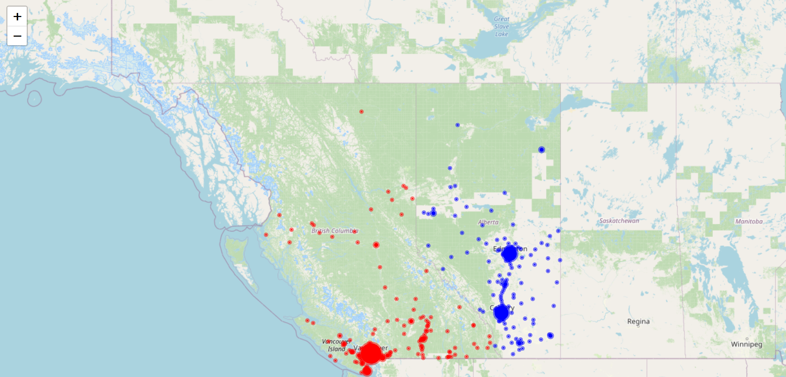
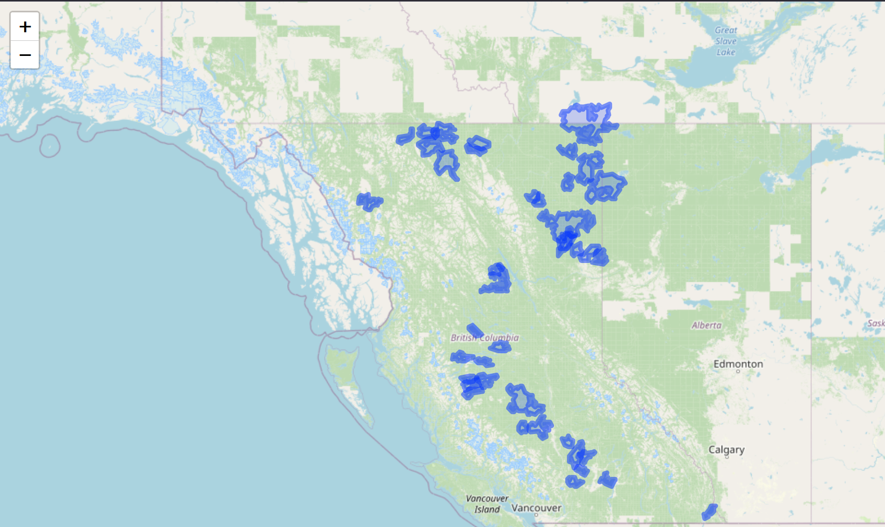
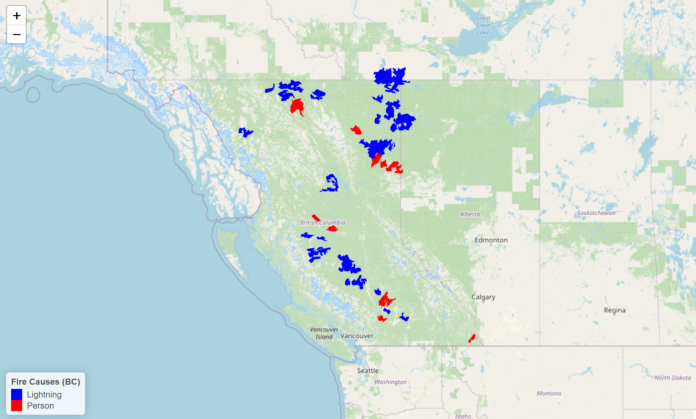

# Leaflet - Interactive Web Maps in R
##  Tutorial Aims
This tutorial will teach you how to create interactive web-based maps using <a href="https://rstudio.github.io/leaflet/"> Leaflet</a>. Leaflet is based in the web scripting language JavaScript and produces interactive maps that can be displayed in the browser!

This tutorial will take you through basic five steps to help familiarize yourself with the package.
1. How to install leaflet
2. Creating your first map
3. Viewing your maps
4. Adding data to your map
5. Customizing your map

--------------------------

Note: Github doesn't allow HTML to be embedded in their markdown files. I have provided images instead, if you click on the image it will take you to a webpage displaying the proper outputted interactive map. Hopes this helps!

<a  name="section1"></a>
## Getting Started
### Installing Leaflet
To get started please open RStudio and install the Leaflet package. You can do this by running the command `install.packages('leaflet')` in R. Then when we need to reference it we write`library(leaflet)` .
### Creating your First Map
Next we can use the leaflet package in R to create a basic map. Leaflet uses a pipe structure similar to the common `dplyr` package.

When creating Leaflet maps, 3 basic lines of code are always used. Think of them as the foundation to any Leaflet map. 
1. `leaflet()` - Tells the script you're creating a leaflet map
2. `addTiles()` - Adds the basemap/background map 
3. `setView(lng, lat, zoom,...)` - Tells the script where and how far away to set the camera. 

Using these 3 starting lines a simple map can be created. This one shows the Canadian provinces of British Columbia and Alberta. If you want to centre the map somewhere else you can find the latitude and longitude coordinates for any point on Earth using https://www.latlong.net/.
```r
# Set the working directory
setwd("your_filepath")
# Load package
library(leaflet)
# Basic Map
m = leaflet() %>% 
  addTiles() %>% #
  setView(-120, 55, zoom = 5)
m # Run our map
```
[](https://rawcdn.githack.com/EdDataScienceEES/tutorial-NevanOpp/9ef301a62d99a7b9a21b469e89dafb65b58c6e27/maps/m1.html)

### My map is blank, what happened?
Usually the map appears in the 'Viewer' section of R. Sometimes this doesn't happen and the screen is just blank. If this happens there is a simple solution: Use the "show in new window" button at the top _Viewer_ tab of RStudio. This will open the map in your default browser allowing you to interact with it there. 

If it is still blank, using the package <a href="https://shiny.posit.co/r/getstarted/shiny-basics/lesson1/"> _Shiny_ </a> is a more permanent solution. Please see the **Shiny tutorial section at the bottom of the page**

## Adding Data To the Map
### Points
What's the point of having a map if there is no data on it? Let's add some points to the map. We can do this manually using the `addMarkers()` function. Simply provide a latitude and longitude.
```r
#Add marker for Vancouver!
m <- m %>% addMarkers(lng = -123.1, lat = 49.3)
m
```
[](https://rawcdn.githack.com/EdDataScienceEES/tutorial-NevanOpp/9ef301a62d99a7b9a21b469e89dafb65b58c6e27/maps/m2.html)

That's great but adding each city manually would be a lot of work. Luckily we can use pre-made databases for our maps too. For this tutorial we are using the <a  href="https://www.rstudio.com/wp-content/uploads/2015/03/ggplot2-cheatsheet.pdf"  target="_blank">Canada Cities Database</a> provided by Simply Maps. Add the data to your 'data' folder in the same directory as the script.

```r
#Import cities and filter for AB and BC
cities <- read.csv('data/cities/canadacities.csv')
cities <- cities[cities$province_id == "BC" | cities$province_id == "AB",]

#Add Markers for each city
m_city <- leaflet() %>% 
  addTiles() %>% 
  setView(-120, 55, zoom = 5) %>%
  addMarkers(data = cities,
		     #use the 'lng' and 'lat' columns to demark locations
             lng = ~lng, lat = ~lat, 
             #create labels when hovering or clicking on points
             label=~city) 
m_city #display map

```
[](https://rawcdn.githack.com/EdDataScienceEES/tutorial-NevanOpp/9ef301a62d99a7b9a21b469e89dafb65b58c6e27/maps/m_city1.html)
This is great but there are so many cities we can't tell them apart! Let's add some symbology to make the map a bit easier to read. We will scale the size of city's based on their population and also colour them by province. 
To do the colouring, we create a custom colour palette. Since our variables are categorical we use the `colorFactor()` function to do this.

We can use `addCircleMarkers()` to create customizable circles for each point. We'll add our colour palette as well as a radius for each point.
```r
province_palette <- colorFactor(c("blue","red"), domain = c("AB","BC")) #Create colour palette

m_city_colours <- leaflet() %>%
  addTiles() %>% 
  setView(-120, 55, zoom = 5) %>%
  addCircleMarkers(data=cities,
                   lng = ~lng, lat = ~lat, #Again, use lng and lat columns
                   color = ~province_palette(province_id), #Make colour based on province
                   radius = ~sqrt(population) * 0.01, #Make radius based on population of city
                   fillOpacity = 1.0 #Make each point opaque
  )
m_city_colours
```
[](https://rawcdn.githack.com/EdDataScienceEES/tutorial-NevanOpp/9ef301a62d99a7b9a21b469e89dafb65b58c6e27/maps/m_city2.html)

<a  name="section1"></a>
###  Polygons
We can also visualize other spatial data such as lines and polygons. Let's put some boundaries on a map!

We'll be using a historical fires dataset for the province of British Columbia. This dataset, provides polygon data for past fires in the province. You can download this data by <a href="https://catalogue.data.gov.bc.ca/dataset/bc-wildfire-fire-perimeters-historical"> requesting it from the BC government </a> or use this <a href="https://drive.google.com/file/d/1WjeCmIZ7es5Icq1xYaAckc4T-GJw8_3J/view?usp=sharing"> google drive link </a> and add it to your 'data' folder.

First lets transform the data so that it can be worked with. Don't worry if you don't understand everything going on here, what's most important to remember is that we need to project our data into the WSG 84 coordinate system. This is done via the `st_transform()`, leaflet only recognizes dataframes with this projection and will not work with others. We've also created a label for each fire which will be used later.

```r
library(sf) #to import and work with shapefiles
library(dplyr)
fires <- read_sf('data/historical_fires/PROT_HISTORICAL_FIRE_POLYS_SP.geojson') #import fires data. May take a couple mins to load
fires <- fires %>% 
  filter(FIRE_SIZE_HECTARES > 50000) %>% #filter for large fires
  select(FIRE_NUMBER,FIRE_YEAR,FIRE_SIZE_HECTARES, FIRE_CAUSE, geometry) %>% #simplify columns
  mutate(label = paste("Fire Size:", FIRE_SIZE_HECTARES, "Hectares |",
                       "Year Started:", FIRE_YEAR))


fires_proj <- st_transform(fires, 4326) #project to WSG 84 (so )
st_crs(fires_proj) #check in console that projection worked properly
 ``` 
 Now that the data is transformed let's add it to a map. We use the aptly named `addPolygons()` function to do this.
 ```r 
 #Create map!
m_fires <- leaflet() %>% 
			   addTiles() %>%
			   setView(-120, 55, zoom = 5) %>%
			   addPolygons(data=fires_proj, # add fire data
              label = ~label) #add a label for each polygon
m_fires
 ```
[](https://rawcdn.githack.com/EdDataScienceEES/tutorial-NevanOpp/9ef301a62d99a7b9a21b469e89dafb65b58c6e27/maps/m_fires1.html)
##  Customization
We can plot data but what else can we do to improve map readability and functionality?

Leaflet provides many options for this. In this example we'll introduce some customization options using our previous example as a baseline.

**Colours**

- Just like before, we can colour-code our fires. The dataset provides a simple cause column for each fire which includes either "Person" or "Lightning". Like before, we can create a colour palette using `colorFactor()` to colour in each of these options. 

**Labels**

- Let's add a label to each fire so that the reader has more information about them. To do this we simply add a new column into the dataset and display that using the `label` option.


**Legend**
- We've added colours to previous maps but how can the reader know what they refer to? Let's add a legend to explain our map even better. Use the `addLegend()` function to do this. We will add its position first, then specify the colour palette and values used.

**Scale Bar**

- In order to show the scale the reader is looking at we can add a simple scale in using `addScaleBar()`

Adding them all together we can create a more detailed and explanatory map!
```r
#create label that combines fire size and year started into 1 string.
fires_proj <- fires_proj %>% 
  mutate(label = paste("Fire Size:", FIRE_SIZE_HECTARES, "Hectares |","Year Started:", FIRE_YEAR))
#create colour palette
fires_palette <- colorFactor(c("blue","red"),domain = c("Lightning","Person"))
#create map
m_fires2 <- leaflet(fires_proj) %>% 
  addTiles() %>% 
  setView(-120, 55, zoom = 5) %>%
  addPolygons(stroke = FALSE, #remove outer stroke
              fillOpacity = 1.0, #100% opacity
              color = ~fires_palette(FIRE_CAUSE), #colour using our custom palette
              label = ~label #use the labels we created earlier 
  ) %>%
  addLegend("bottomleft", #put legend in top right
            pal = fires_palette, #use the fires palette colours
            values = ~FIRE_CAUSE, #use the fire cause values
            title = "Fire Causes (BC)", #Title of legend
            opacity = 1 #legend should be opaque
  ) %>%
  addScaleBar(position = "topright",
              options = scaleBarOptions(imperial = FALSE))
m_fires2
```
[](https://rawcdn.githack.com/EdDataScienceEES/tutorial-NevanOpp/9ef301a62d99a7b9a21b469e89dafb65b58c6e27/maps/m_fires2.html)
## Export your map
To export your map as an html file you can use the `htmlwidgets` library. This simple code will export your map as a html file allowing you to open it in a browser. Use the `saveWidgets(<map>,file=<filepath>)` function.
```r
library(htmlwidgets)
saveWidget(m, file="maps/m.html") #save map m to maps/m.html
```
## Using Shiny for dynamic development
Shiny is a web-app hosting library that allows you to host your map on a local server on your computer. It is simple to set up and should just launch out of R.

Copy and run the code below feel free to change the size of the map. Make sure you have Shiny installed via `install.packages('shiny')`
```r
library(shiny)

currentMap <- m #variable which will hold your map data
#ui for webpage
ui <- fluidPage(
  titlePanel("Interactive Leaflet Map"),
  mainPanel(
    leafletOutput("map",height=750,width=1200)
  )
)
#backend server which renders a leaflet map
server <- function(input, output, session) {
  output$map <- renderLeaflet(currentMap)
}

#run this to get output (do this each time you make a new map)
shinyApp(ui = ui, server = server)
```

Now when you want to run your map simply set `currentMap <- <map_name>` and then run the line `shinyApp(ui = ui, server = server)`. For example, if using the code from the tutorial, you would do `currentMap <- m_fires2` then `shinyApp(ui = ui, server = server)`. This will launch a web-app with the leaflet map.
